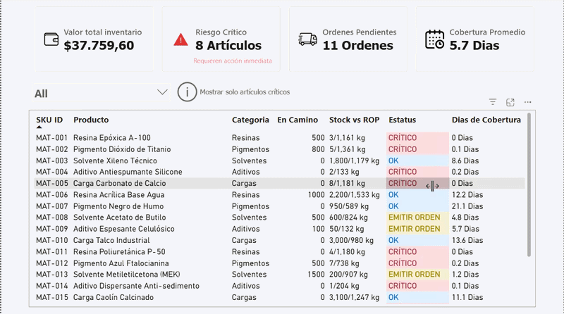

# MRP-Inventory-Project
# Sistema de Control de Inventario Inteligente (MRP) | SQL & Power BI

[](https://www.mysql.com)
[](https://powerbi.microsoft.com)
[](#)

Este proyecto simula y resuelve un problema crítico en la gestión de cadena de suministro (Supply Chain): **la falta de visibilidad en el inventario, las roturas de stock y el exceso de existencias.** 

A través de una arquitectura que conecta una base de datos relacional en **MySQL** con un modelo en **Power BI**, el sistema calcula automáticamente puntos de pedido (ROP), inventarios de seguridad y genera alertas visuales en tiempo real para la toma de decisiones.

---

## Vista Previa del Dashboard


---

## El Problema de Negocio (Caso de Estudio)
Una fabrica o distribuidor mediano de productos se enfrenta a constantes pérdidas financieras debido a:
1. **Dinero congelado:** Exceso de stock en productos de baja rotación.
2. **Pérdida de ventas:** Roturas de stock en artículos críticos por no saber cuándo reordenar.
3. **Falta de automatización:** El equipo de compras pasa más de 10 horas semanales cruzando hojas de Excel de forma manual.

---

## Arquitectura de la Solución
El proyecto se diseñó utilizando un flujo de datos profesional, garantizando la escalabilidad y el rendimiento:

```text
[ Base de Datos SQL ]  ──(Consultas de Limpieza)──>  [ Power BI / Power Query ]  ──(Modelo de datos/DAX)──>  [ Dashboard Interactivo ]
